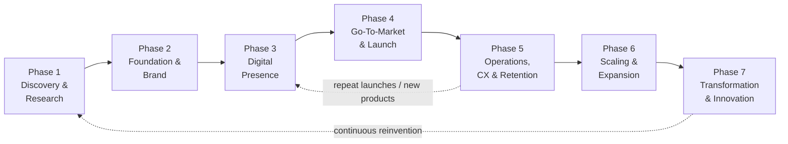

# 01 — Complete Client Lifecycle Map

The client lifecycle is the backbone of the entire 360° model. Every client —
whether a pre-launch startup or an established enterprise — can be located on this
map, and our job is to **move them forward, phase by phase, without ever losing
the relationship.**

> The dotted loops matter: a healthy client re-enters earlier phases for new
> products, markets, and reinventions. **The lifecycle is a flywheel, not a finish line.**

---

## How to Read Each Phase

For every phase we define six things, so the whole company shares one mental model:

1. **Client Objective** — what success looks like *to the client*.
2. **Client Challenges** — the pain that makes them buy.
3. **Key Activities** — what actually gets done.
4. **Services Connected** — which of our service lines lead and support.
5. **Deliverables** — the tangible outputs we hand over.
6. **Exit Trigger → Next Phase** — the signal that the client is ready to progress
   (this is the cross-sell moment).

---

## PHASE 1 — Discovery & Business Research

| Dimension | Detail |
|-----------|--------|
| **Client objective** | Validate the idea, understand demand, know the audience and competition, define where the money is. |
| **Client challenges** | Uncertainty, no data to justify investment, fear of building the wrong thing, no clear differentiation. |
| **Key activities** | Market research, consumer behavior analysis, competitor benchmarking, SWOT, industry trend analysis, feasibility study, business-model design. |
| **Lead services** | Strategy & Consulting (business consulting, startup advisory, feasibility). |
| **Supporting services** | Branding (positioning & persona research), Digital (market-gap & SEO opportunity mapping), Finance (budget, revenue forecast, cost analysis). |
| **Deliverables** | Business strategy report · Market opportunity report · Target audience profile · Competitor landscape · Initial roadmap. |
| **Exit trigger → Phase 2** | "The idea is validated and we have a roadmap." → Client needs an identity and a legal/operational base. |

---

## PHASE 2 — Business Foundation & Brand Creation

| Dimension | Detail |
|-----------|--------|
| **Client objective** | Build a credible identity, establish trust and positioning, set up the operational + legal foundation. |
| **Client challenges** | Looking unprofessional, legal/compliance risk, no processes, no tools, inconsistent identity. |
| **Key activities** | Brand identity creation, company setup, business registration, legal documentation, operational planning. |
| **Lead services** | Branding & Creative + Legal & Compliance + Operations. |
| **Supporting services** | Technology (domain, email, CRM, business tools setup), Strategy (operating-model design). |
| **Deliverables** | Full brand identity (logo, guidelines, visual system, messaging, tone) · Company assets · Operational framework (SOPs, team structure, workflows) · Legal setup via compliance partners (registration, trademark, contracts) · Digital infrastructure. |
| **Exit trigger → Phase 3** | "We have a brand and a legal base." → Client needs to be findable and sellable online. |

---

## PHASE 3 — Digital Presence & Online Business Setup

| Dimension | Detail |
|-----------|--------|
| **Client objective** | Establish online presence, build digital credibility, enable online operations and selling. |
| **Client challenges** | No website / weak site, can't sell online, no analytics, no lead capture, poor mobile experience. |
| **Key activities** | Website development, e-commerce setup, social media setup, SEO foundation, analytics integration. |
| **Lead services** | Web & Technology. |
| **Supporting services** | Digital Marketing (SEO setup, Google Business Profile, social creation, content strategy), Creative (product photography, video, UI/UX, social creatives), Automation (CRM integration, lead funnel, email automation, chatbot). |
| **Deliverables** | Launch-ready website · Social platforms · Analytics dashboard · Sales funnel · Online store. |
| **Exit trigger → Phase 4** | "We're live and able to transact." → Client needs traffic, awareness, and customers. |

---

## PHASE 4 — Go-To-Market & Business Launch

| Dimension | Detail |
|-----------|--------|
| **Client objective** | Generate awareness, acquire customers, create market-entry momentum. |
| **Client challenges** | No audience yet, high cost of acquisition, weak conversion, no sales process, no PR/credibility. |
| **Key activities** | Launch campaign, paid advertising, digital PR strategy, influencer collaborations, sales activation. |
| **Lead services** | Marketing + Sales Support. |
| **Supporting services** | Digital PR & Influencer (online media outreach, podcasts, creator collaborations), Marketplaces & Affiliate (channel reach), Automation (lead nurture). |
| **Deliverables** | Marketing campaigns · Launch strategy · Lead acquisition system · PR coverage · Sales process. |
| **Exit trigger → Phase 5** | "Customers are coming in." → Client needs to serve, satisfy, and retain them. |

---

## PHASE 5 — Operations, Customer Experience & Retention

| Dimension | Detail |
|-----------|--------|
| **Client objective** | Improve efficiency, increase satisfaction, retain customers, increase lifetime value. |
| **Client challenges** | Churn, slow/messy operations, no feedback loop, no loyalty, reputation risk, no visibility into KPIs. |
| **Key activities** | Customer support systems, workflow optimization, feedback systems, loyalty programs. |
| **Lead services** | Customer Experience + Operations + Data & Analytics. |
| **Supporting services** | Automation (marketing, support, workflow), Branding (reputation), Technology (ERP/inventory). |
| **Deliverables** | Retention systems · CX framework · Operational dashboards · Process optimization. |
| **Exit trigger → Phase 6** | "The engine runs and customers stay." → Client is ready to pour fuel on growth. |

---

## PHASE 6 — Business Scaling & Expansion

| Dimension | Detail |
|-----------|--------|
| **Client objective** | Scale revenue, expand market reach, build sustainable growth. |
| **Client challenges** | Growth ceilings, operational strain, capital needs, new-market risk, channel saturation. |
| **Key activities** | Expansion strategy, franchise models, international growth, product diversification. |
| **Lead services** | Growth Strategy + Performance Marketing + Investment & Finance. |
| **Supporting services** | Technology Scaling (advanced automation, AI, scalable infra, data systems), Operations (multi-location/franchise management). |
| **Deliverables** | Scale roadmap · Growth dashboards · Expansion strategy · Revenue optimization plan. |
| **Exit trigger → Phase 7** | "We're a real business at scale." → Client needs to stay ahead and protect long-term value. |

---

## PHASE 7 — Long-Term Transformation & Innovation

| Dimension | Detail |
|-----------|--------|
| **Client objective** | Stay competitive, innovate continuously, build long-term enterprise value. |
| **Client challenges** | Disruption, aging brand, legacy tech, complacency, talent and capability gaps. |
| **Key activities** | Digital transformation, AI implementation, innovation strategy, brand evolution. |
| **Lead services** | Innovation + Strategy + Data & Intelligence. |
| **Supporting services** | All service lines, re-applied at enterprise maturity (rebranding, platform rebuilds, new ventures). |
| **Deliverables** | Transformation roadmap · Innovation framework · Future-ready business model. |
| **Exit trigger → loop back** | New ventures, products, and markets restart the cycle at Phase 1/3 — the flywheel turns again. |

---

## The Lifecycle as a Maturity Model

The same map doubles as a **client maturity assessment**. During onboarding (and
quarterly thereafter), score the client 0–5 on each phase. The lowest mature,
highest-impact phase is the natural next engagement.

| Maturity score | Meaning | Our motion |
|---|---|---|
| 0 | Not started | Sell the entry project for that phase |
| 1–2 | Started, weak | Audit + rebuild |
| 3 | Functional | Optimize + integrate |
| 4 | Strong | Scale + automate |
| 5 | Best-in-class | Innovate + maintain on retainer |

> **Account-team rule:** never present a single service in isolation. Always show
> the client *where they are on the map* and *what the next two phases unlock*.
> This is what turns a project buyer into a journey buyer.
