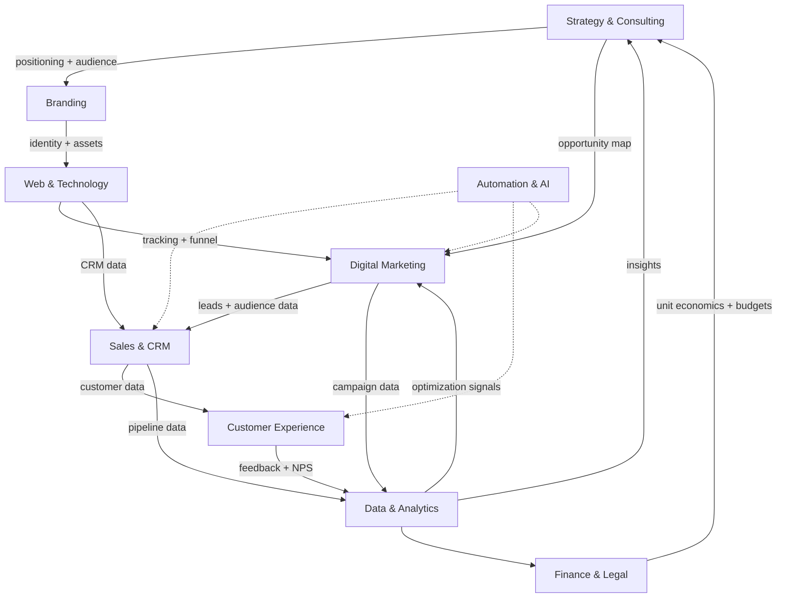

# 02 — Service-to-Phase Integration Framework

This is the engine room of the 360° model. It answers the central question:
**"For any service line, what is its job in every phase — and how does it hand off
to the next service?"**

Integration is what separates a 360° *partner* from a collection of *vendors*.

---

## 2.1 The Master Integration Matrix

Rows = service lines. Columns = lifecycle phases. Each cell = the specific job that
service does in that phase.

| Service Line | P1 Discovery | P2 Foundation | P3 Digital | P4 Launch | P5 Operate/Retain | P6 Scale | P7 Transform |
|---|---|---|---|---|---|---|---|
| **Strategy & Consulting** | Market & feasibility research, business model | Operating-model design | Digital roadmap | GTM strategy | Performance review | Expansion strategy | Transformation strategy |
| **Branding & Creative** | Positioning, personas, naming | Identity, guidelines, packaging | Web visuals, UI/UX, social creative | Campaign creative | Reputation & CX brand | Sub-brands, new markets | Rebrand / brand evolution |
| **Web & Technology** | Tech opportunity scan | Domain, email, CRM, tooling | Website, e-comm, app, hosting | Landing pages, tracking | ERP, inventory, support tech | Scalable infra, integrations | AI platforms, re-platforming |
| **Digital Marketing** | SEO & market-gap mapping | Channel planning | SEO foundation, GBP, social setup | Paid ads, influencer, email | Retargeting, lifecycle email | Omnichannel, advanced SEO | Predictive & intelligent media |
| **Sales & CRM** | Revenue model | CRM setup | Funnel & lead capture | Pipeline, scripts, CRO | Renewal/upsell motions | Channel & partner sales | Revenue intelligence |
| **Customer Experience** | — | CX principles | Support channels setup | Onboarding flows | Helpdesk, loyalty, journey, reputation | CX at scale | Predictive CX |
| **Operations** | Feasibility of ops | SOPs, team, workflows | Ops tooling | Launch logistics | Workflow optimization, training | Multi-site / franchise ops | Process transformation |
| **Data & Analytics** | Market data, forecasts | KPI definition | Analytics integration | Campaign measurement | KPI dashboards, retention analytics | Growth dashboards, cohort/LTV | Predictive & market intelligence |
| **Finance & Legal** | Budget, forecast, cost | Registration, trademark, contracts | Payment/e-comm compliance | Campaign budgeting | Unit economics | Investor deck, fundraising | Financial optimization, M&A |
| **Automation & AI** | — | Tool selection | CRM, funnel, email, chatbot | Lead nurture automation | Support & workflow automation | Advanced automation | AI integration & innovation |

> **How account teams use this:** find the client's current phase (column), read
> down to see every team that should be involved, then read *right* to pitch the
> next phase's version of each service. That rightward read **is** the cross-sell map.

---

## 2.2 Cross-Phase Service Journeys

Each service line has a story that runs the full length of the lifecycle. Selling
the *journey* (not the task) is how a one-off becomes a multi-year retainer.

### Branding
```
Research → Identity → Website Visuals → Campaign Creative → CX & Reputation → Sub-brands → Rebrand
  P1          P2            P3                 P4                P5               P6           P7
```
*Why it compounds:* the positioning from P1 informs the identity in P2, which
drives the website in P3, the ads in P4, and is protected/evolved in P5–P7. Each
phase reuses and increases the value of the last.

### Digital Marketing
```
SEO/Market Gap → Channel Plan → SEO Setup → Launch Ads → Retargeting/Retention → Scaling Campaigns → Predictive Media
     P1              P2            P3            P4              P5                      P6                  P7
```
*Why it compounds:* audience data captured at launch fuels retargeting, which
trains the lookalike and predictive models that make scaling efficient.

### Technology
```
CRM → Website → Automation → Analytics → ERP/Support → Scalable Infra → AI Platforms
 P2      P3        P3            P3          P5             P6              P7
```
*Why it compounds:* the CRM is the spine; every later system plugs into it, so
each new tool increases switching cost and deepens the partnership.

### Operations
```
SOPs → Workflows → Team Systems → Automation → Multi-site/Franchise → Transformation
  P2       P2          P2/P5         P5              P6                     P7
```

### Sales & Revenue
```
Revenue Model → CRM → Funnel → Pipeline/CRO → Renewals & Upsell → Channel/Partner → Revenue Intelligence
     P1          P2     P3         P4              P5                   P6                  P7
```

---

## 2.3 How Services Integrate With Each Other (Not Just With Phases)

Phase integration is vertical. **Service-to-service integration is horizontal** —
and it's where most agencies fail. These are the critical handoffs to engineer.



### The non-negotiable integration handoffs

| From → To | What flows | Why it matters |
|-----------|-----------|----------------|
| Strategy → Branding | Positioning, personas, naming | Brand is built on validated insight, not taste |
| Branding → Web/Tech | Identity system, assets, UX direction | Website expresses the brand consistently |
| Web/Tech → Marketing | Pixels, events, landing pages, attribution | Ads send traffic to optimized, tracked destinations |
| Marketing → Sales/CRM | Qualified leads + source data | No leads lost; sales knows context |
| Sales/CRM → CX | Customer records, history | Onboarding and support are personalized |
| CX → Data | Feedback, NPS, churn signals | Retention is measured and acted on |
| Everything → Data → Strategy | KPIs, ROI, cohorts | Strategy is re-informed every quarter (the flywheel) |
| Finance ↔ Strategy | Budgets, unit economics, LTV/CAC | Decisions are grounded in money, not vibes |

> **The single source of truth:** the **CRM + analytics layer** is the shared
> nervous system. Every service writes to it and reads from it. This is what makes
> the 360° model *integrated* rather than merely *bundled*.

---

## 2.4 Integration Anti-Patterns to Avoid

| Anti-pattern | Symptom | Fix |
|---|---|---|
| Siloed delivery | Each team emails files and disappears | Shared account team + single project space |
| Re-discovery tax | Every team re-asks the client the same questions | One client brief + shared CRM record |
| Untracked launches | Ads run with no pixels / attribution | Web/Tech sets up tracking *before* Marketing spends |
| Orphaned leads | Marketing generates leads no one works | Mandatory Marketing→Sales SLA and routing |
| Vanity reporting | Each team reports its own metric | One KPI tree rolling up to client outcomes (see `09`) |

---

## 2.5 The Integration Checklist (use on every engagement)

- [ ] Is there a single account owner across all active service lines?
- [ ] Does every team read from and write to the shared CRM + analytics layer?
- [ ] Has the upstream handoff (data/assets) been received before work starts?
- [ ] Is the "next phase" identified and on the account roadmap?
- [ ] Is there one client-facing KPI dashboard, not one per team?
- [ ] Are online and offline efforts attributed to the same funnel (see `05`)?
