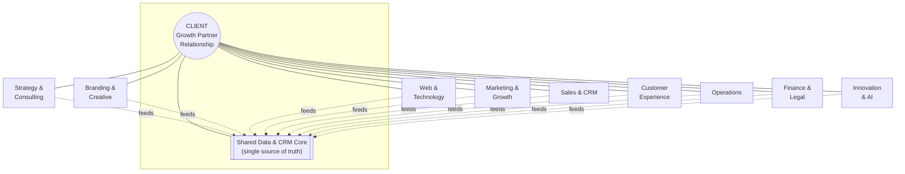
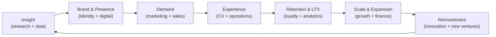
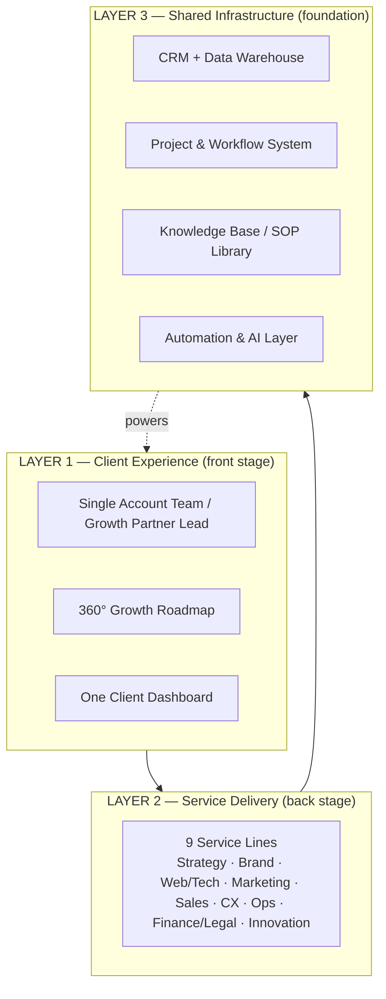
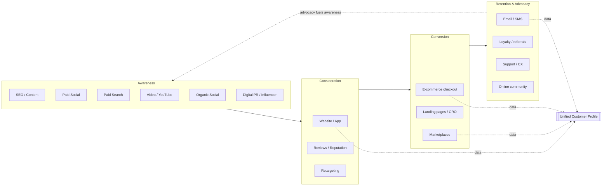
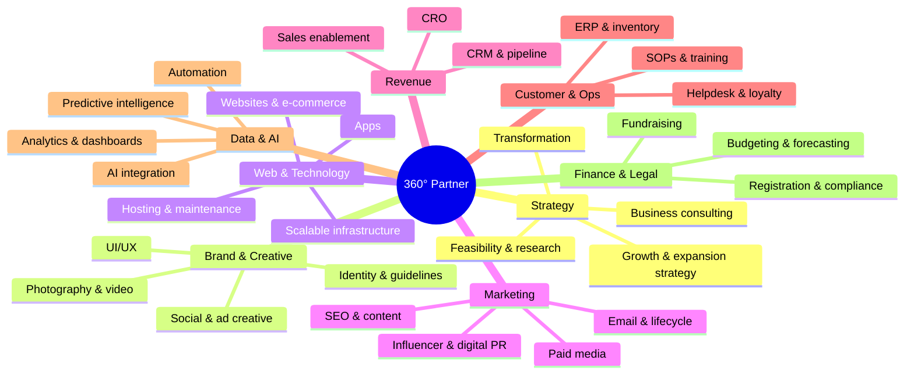
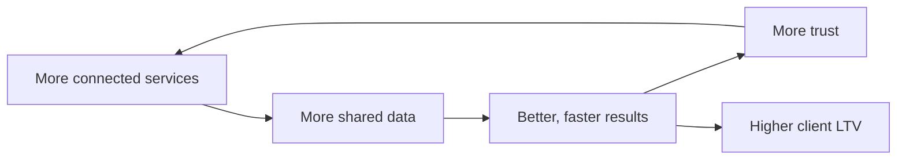

# 03 — The Visual Business Ecosystem

This document visualizes the whole company as a connected ecosystem: the client at
the center, service lines orbiting them, a shared data core binding everything, and
the lifecycle flywheel driving recurring growth.

> All diagrams use Mermaid, which renders natively on GitHub. View this file on
> GitHub (or any Mermaid-enabled viewer) to see the visuals.

---

## 3.1 The Ecosystem Overview — Client at the Center

**Reading it:** the client is the hub. Nine service lines orbit and serve them. A
shared data + CRM core sits beneath the relationship — every service both feeds it
and draws from it. That core is what makes us *integrated*, not just *full-service*.

---

## 3.2 The Growth Flywheel

The ecosystem is powered by a flywheel: each turn makes the next turn easier and
cheaper, because data, brand equity, and trust compound.

> Each stage produces an asset the next stage consumes: insight → assets → customers
> → data → loyalty → capital → new insight. **Momentum is the moat.**

---

## 3.3 The Three Layers of the Ecosystem

| Layer | Purpose | Owner |
|-------|---------|-------|
| **1 — Client Experience** | The single, seamless relationship the client feels | Account / Growth Partner Lead |
| **2 — Service Delivery** | The specialist teams that do the work | Service-line directors |
| **3 — Shared Infrastructure** | The data, tools, automation, and SOPs that connect everything | Operations / RevOps |

---

## 3.4 The Unified Digital Funnel as One Ecosystem

The point: **every digital channel writes into the same customer profile**, tied
together by pixels, UTMs, and CRM IDs. One funnel, one profile, one attribution
model — no channel runs in a silo. Full detail in
[`05`](05-digital-channel-strategy.md).

---

## 3.5 The Service Constellation (what we sell, grouped)

---

## 3.6 How the Ecosystem Creates Lock-In (Healthy, Value-Based)

Lock-in here is *earned*, not contractual: the more of the ecosystem a client uses,
the richer their shared data, the better our results, the deeper the trust — which
naturally pulls in more services. This loop is the commercial heart of the model and
is operationalized in [`06 — Client Retention Model`](06-client-retention-model.md).
