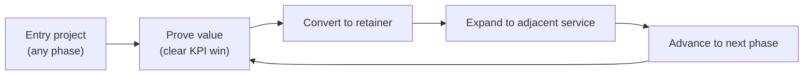

# 04 — Revenue Opportunities Per Phase

The 360° model is a revenue *system*, not a price list. Each phase opens specific
revenue streams, and — crucially — each project should convert into **recurring
revenue** and **the next phase's project**.

> Pricing figures below are **illustrative ranges** to show *relative* value and
> structure. Calibrate to your market, currency, and cost base before quoting.

---

## 4.1 The Three Revenue Types

| Type | Description | Margin profile | Strategic role |
|------|-------------|----------------|----------------|
| **Project (one-off)** | Fixed-scope deliverable (e.g., website, brand) | Medium–high | Entry point; proof of value |
| **Retainer (recurring)** | Ongoing monthly service (marketing, support, ops) | High & predictable | The core of enterprise value |
| **Performance / equity** | Revenue share, rev-per-result, or equity | Variable, high upside | Aligns incentives; premium positioning |

**Target portfolio mix at maturity:** ~60% retainer, ~30% project, ~10%
performance/equity. Retainers create the predictable base; projects create entry
and expansion; performance deals create upside and differentiation.

---

## 4.2 Revenue Map by Phase

### Phase 1 — Discovery & Research
| Stream | Model | Illustrative range |
|---|---|---|
| Market research & feasibility study | Project | $$ |
| Business strategy / startup advisory | Project or advisory retainer | $$ |
| Financial forecasting & budgeting | Project | $ |
**Recurring hook:** monthly **strategic advisory retainer**.
**Next-phase trigger:** validated idea → Foundation & Brand.

### Phase 2 — Foundation & Brand Creation
| Stream | Model | Illustrative range |
|---|---|---|
| Brand identity system | Project | $$–$$$ |
| Legal setup (registration, trademark, contracts) | Project + referral fees | $$ |
| Operations setup (SOPs, tooling) | Project | $$ |
| Domain/email/CRM configuration | Project + tool reseller margin | $ |
**Recurring hook:** **brand-guardianship retainer** + tool management fees.
**Next-phase trigger:** brand ready → Digital Presence.

### Phase 3 — Digital Presence & Online Setup
| Stream | Model | Illustrative range |
|---|---|---|
| Website / e-commerce build | Project | $$$ |
| App development | Project | $$$$ |
| Content, photography, video production | Project | $$ |
| Hosting, maintenance, support | **Retainer** | $/mo recurring |
| Analytics & funnel setup | Project | $$ |
**Recurring hook:** **hosting + maintenance + CRO retainer** (very sticky).
**Next-phase trigger:** live & sellable → Go-To-Market.

### Phase 4 — Go-To-Market & Launch
| Stream | Model | Illustrative range |
|---|---|---|
| Launch campaign (creative + strategy) | Project | $$$ |
| Paid media management | **Retainer + % of ad spend** | recurring |
| Influencer & digital PR programs | Project or retainer | $$–$$$ |
| Marketplace & affiliate launch (e.g., Amazon, app stores) | Project + commission | $$ |
| Sales enablement & CRO | Project + retainer | $$ |
**Recurring hook:** **always-on performance marketing retainer** (% of spend +
management fee). This is often the single largest recurring line.
**Next-phase trigger:** customers flowing → Operations & Retention.

### Phase 5 — Operations, CX & Retention
| Stream | Model | Illustrative range |
|---|---|---|
| Helpdesk / support systems | Project + retainer | recurring |
| Loyalty & retention programs | Retainer | recurring |
| ERP / inventory / ops tooling | Project + license margin | $$$ |
| Reporting & analytics dashboards | **Retainer** | recurring |
| Marketing & support automation | Project + retainer | recurring |
**Recurring hook:** **CX + analytics + automation managed service** — high margin,
high stickiness, directly tied to client's retained revenue.
**Next-phase trigger:** stable & retaining → Scale.

### Phase 6 — Scaling & Expansion
| Stream | Model | Illustrative range |
|---|---|---|
| Expansion / franchise strategy | Project + success fee | $$$$ |
| Performance marketing at scale | Retainer + performance | recurring + upside |
| Infrastructure & automation scaling | Project + retainer | $$$ |
| Fundraising / investor materials | Project + **success fee / %** | high upside |
**Recurring hook:** expanded multi-market retainers; performance share on growth.
**Next-phase trigger:** at scale → Transformation.

### Phase 7 — Transformation & Innovation
| Stream | Model | Illustrative range |
|---|---|---|
| Digital transformation programs | Large project / program | $$$$ |
| AI implementation & automation consulting | Project + retainer | $$$ |
| Rebranding & brand evolution | Project | $$$ |
| Predictive analytics & market intelligence | **Retainer** | recurring |
**Recurring hook:** **innovation/intelligence retainer**; transformation programs
restart the flywheel and re-open earlier phases for new ventures.

---

## 4.3 Client Lifetime Value (LTV) Illustration

A client who enters at Phase 1 and is nurtured through the lifecycle is worth
*multiples* of a one-off buyer. The model below shows how value accumulates.

```
Phase 1   ▓▓                      Project: strategy
Phase 2   ▓▓▓▓                    Project: brand + legal + ops
Phase 3   ▓▓▓▓▓▓  + recurring     Project: website  +  hosting/maintenance retainer
Phase 4   ▓▓▓▓▓▓▓▓ + recurring    Project: launch   +  performance marketing retainer
Phase 5   ▓▓▓▓▓▓▓▓▓▓ + recurring  Retainers: CX + analytics + automation
Phase 6   ▓▓▓▓▓▓▓▓▓▓▓▓ + perf     Expansion projects + performance share
Phase 7   ▓▓▓▓▓▓▓▓▓▓▓▓▓▓ + recur  Transformation programs + intelligence retainer
          └──────── cumulative LTV grows with every phase ────────┘
```

**LTV levers (what we actively manage):**
- **Cross-sell rate** — average # of service lines per client (target: grow over time).
- **Retainer attach rate** — % of projects that convert to recurring revenue.
- **Phase progression rate** — % of clients who advance to the next phase.
- **Net revenue retention** — recurring revenue growth within existing accounts.

---

## 4.4 The Cross-Sell & Upsell Engine



**Rules of the engine:**
1. **Land with a clear, fast win.** The entry project must produce a visible result
   (a metric the client can repeat to their boss).
2. **Always quote the retainer alongside the project.** Make recurring the default.
3. **Review quarterly using the maturity model** (`01`) to surface the next phase.
4. **Bundle adjacent services** at a better rate than buying them separately.
5. **Tie performance fees to the metrics on the shared dashboard** (`09`) so upside
   is transparent and trusted.

---

## 4.5 Packaging Tiers (how to present 360°)

| Tier | What it is | Revenue model | Best for |
|------|-----------|---------------|----------|
| **À la carte projects** | Single deliverables | Project | New / cautious clients |
| **Phase package** | All services for one phase, bundled | Project + entry retainer | Clients at a clear inflection point |
| **Growth Partner retainer** | Ongoing multi-service across phases | Monthly retainer (+ performance) | Committed, scaling clients |
| **Equity / venture partnership** | Deep involvement for revenue/equity share | Performance / equity | High-potential startups |

> **Positioning line for sales:** "You can buy a project, or you can buy a growth
> partner. The project gets you one result; the partnership gets you every result,
> connected — and it costs less per outcome because everything compounds."
