# 05 — Digital Channel & Funnel Strategy

As an **online-only 360° digital provider**, our edge is not "we run ads." It is
that we orchestrate *every* digital channel as **one customer, one journey, one
funnel, one measurement model** — instead of letting SEO, paid, social, email, and
on-site experience run as disconnected silos with their own budgets and their own
vanity reports.

---

## 5.1 The Guiding Principle: One Funnel, Every Channel

The customer doesn't think in channels. They discover a brand on social, search it,
read reviews, get retargeted, buy on the site, and get nurtured by email. Our
strategy mirrors that single continuous journey:

```mermaid
flowchart LR
    subgraph DISCOVER[Awareness]
        SEO[SEO / Content]
        PSOCIAL[Paid Social]
        PSEARCH[Paid Search]
        VIDEO[Video / YouTube]
        ORG[Organic Social]
        DPR[Digital PR / Influencer]
    end
    subgraph CONSIDER[Consideration]
        WEB[Website / App]
        REVIEWS[Reviews / Reputation]
        RETARGET[Retargeting]
        EMAILTOP[Lead-magnet / Email capture]
    end
    subgraph CONVERT[Conversion]
        ECOM[E-commerce checkout]
        LP[Landing pages / CRO]
        MKT[Marketplaces]
    end
    subgraph KEEP[Retention & Advocacy]
        EMAIL[Email / SMS]
        LOYALTY[Loyalty / referrals]
        SUPPORT[Support / CX]
        COMMUNITY[Online community]
    end
    DISCOVER --> CONSIDER --> CONVERT --> KEEP --> DISCOVER
```



Every box writes into the **same customer profile** (stitched by pixels, UTMs, and
CRM IDs) so the journey is continuous, attributable, and optimizable.

---

## 5.2 Channels by Funnel Stage

| Funnel stage | Primary digital channels | Job to be done |
|--------------|--------------------------|----------------|
| **Awareness** | SEO & content, paid social, video/YouTube, organic social, digital PR, influencer | Reach new audiences and create demand |
| **Consideration** | Website/app, retargeting, email capture, reviews & reputation, comparison/SEO content | Build trust and stay top-of-mind |
| **Conversion** | Paid search, landing pages & CRO, e-commerce, marketplaces, email/SMS offers | Turn intent into transactions |
| **Retention** | Email/SMS lifecycle, loyalty, support/CX, app/push | Increase repeat purchase and LTV |
| **Advocacy** | Reviews, referrals, online community, user-generated content | Turn customers into a growth channel |

---

## 5.3 Channels by Lifecycle Phase

| Phase | Channel emphasis | What we do |
|-------|------------------|------------|
| **1 Discovery** | Search & social listening | Keyword/demand research, social listening, digital competitor scan, SEO gap analysis |
| **2 Foundation** | Owned channels setup | Domain, brand profiles, analytics, channel & content plan |
| **3 Digital Presence** | Website, SEO, social, GBP | Launch-ready site/store, SEO foundation, social presence, tracking |
| **4 Launch** | Paid social/search, influencer, email | Launch campaigns, creator collabs, digital PR, lead capture |
| **5 Operate/Retain** | Email/SMS, retargeting, reviews, support | Lifecycle automation, reputation, retargeting, support channels |
| **6 Scale** | Omnichannel paid, marketplaces, new geos | Scale spend, add channels/marketplaces, expand to new digital markets |
| **7 Transform** | AI personalization, predictive media | Predictive audiences, personalization, automated optimization |

---

## 5.4 The Digital Channel Portfolio

| Channel | Primary job | Phase emphasis |
|---|---|---|
| SEO & content | Capture existing demand, build authority | 3 → 7 |
| Paid search (PPC) | Convert high-intent demand | 4 → 6 |
| Paid social | Create demand, retarget | 4 → 6 |
| Video / YouTube | Awareness, education, retargeting | 4 → 7 |
| Email / SMS / push | Nurture, retain, reactivate | 4 → 7 |
| Organic social | Brand, community, social proof | 2 → 7 |
| Digital PR & influencer | Credibility, reach, backlinks | 4, 6, 7 |
| Marketplaces & affiliate | Reach + distribution | 6 |
| Website / app / e-commerce | Convert + transact | 3 → 7 |
| Online community | Retention, advocacy, insight | 5 → 7 |

---

## 5.5 The Connection Mechanisms (where most agencies drop the ball)

A "360° digital" promise is only real if the channels are technically wired
together. These are the mechanisms that keep the funnel unbroken and **attributable**:

| Mechanism | Connects | What it enables |
|---|---|---|
| **UTM tagging** (consistent taxonomy) | Every campaign → analytics | Clean source/medium attribution |
| **Pixels & server-side tracking** | Ads ↔ site events | Accurate conversion data, better optimization |
| **CRM / customer ID stitching** | Anonymous → known user | One profile across sessions and channels |
| **Shared audiences** | CRM ↔ ad platforms | Retargeting, lookalikes, suppression lists |
| **Consent & first-party data layer** | Site ↔ all tools | Privacy-safe, durable measurement |
| **Lead routing** | Forms/ads → CRM → sales | No lead lost; full context for follow-up |
| **Marketing automation** | CRM ↔ email/SMS | Triggered lifecycle journeys at scale |

> **Rule:** no channel goes live without tracking and CRM wiring in place. If we
> can't measure and connect it, we fix that before we spend.

---

## 5.6 Unified Measurement

Every channel rolls up into one funnel and one dashboard (see [`09`](09-kpi-tracking-system.md)):

```
        AWARENESS  →  CONSIDERATION  →  CONVERSION  →  RETENTION  →  ADVOCACY
Reach:   impressions    site visits      add-to-cart    repeat rate   reviews/shares
Action:  CTR / engage    leads captured   purchases      LTV growth    referrals
                         │                                    │
                         └──── unified via pixels / UTMs / CRM IDs ────┘
                                          ↓
                            ONE CUSTOMER PROFILE + ONE FUNNEL VIEW
```

**Shared metrics across all channels:** blended CAC, blended ROAS, assisted
conversions (cross-channel), channel contribution to revenue, and LTV by acquisition
source.

---

## 5.7 Budget Allocation Logic

Don't split budget by "the channel each specialist likes to defend." Allocate by
**job-to-be-done and measured contribution**:

1. **Start** with an awareness/conversion/retention split appropriate to the phase
   (early phases lean awareness; later phases lean conversion + retention).
2. **Measure** every channel's contribution to the unified funnel (including assisted
   conversions, not just last-click).
3. **Reallocate** monthly toward the channels with the best marginal return for the
   current objective.
4. **Protect** a fixed % for top-of-funnel/brand so the funnel keeps filling.

> The 360° digital advantage: because we run every channel **and** measure them in
> one model, we can move budget to whatever works — most single-discipline agencies
> are structurally biased toward defending their own channel.
