# 05 — Online + Offline Strategy Alignment

A true 360° partner doesn't run "digital" and "traditional" as separate teams with
separate budgets and separate reports. **One customer, one journey, one funnel,
one measurement model** — expressed across both online and offline channels.

---

## 5.1 The Guiding Principle: O2O (Online-to-Offline and back)

The customer doesn't think in channels. They research online, buy in-store, get
support on WhatsApp, and post a review on social. Our strategy mirrors that reality:

```mermaid
flowchart LR
    subgraph DISCOVER[Discover]
        SEO[Search/SEO]
        SOCIAL[Social]
        OOH[Billboards/Print]
        WOM[Word of mouth / Events]
    end
    subgraph CONSIDER[Consider]
        WEB[Website]
        REVIEWS[Reviews/Reputation]
        STORE[Store visit / Showroom]
    end
    subgraph CONVERT[Convert]
        ECOM[Online checkout]
        POS[In-store POS]
        SALESREP[Sales rep]
    end
    subgraph KEEP[Keep & Grow]
        EMAIL[Email/SMS]
        LOYALTY[Loyalty program]
        SUPPORT[Support/CX]
        COMMUNITY[Community/Events]
    end
    DISCOVER --> CONSIDER --> CONVERT --> KEEP --> DISCOVER
```



Every box — online or offline — writes into the **same customer profile** so the
journey is continuous and measurable.

---

## 5.2 Online + Offline by Lifecycle Phase

| Phase | Online plays | Offline plays | The bridge (how they connect) |
|-------|-------------|---------------|-------------------------------|
| **1 Discovery** | Search trends, social listening, digital competitor scan | Field interviews, focus groups, retail audits | Combine digital demand data with on-the-ground insight |
| **2 Foundation** | Domain, digital brand assets, profiles | Printed identity, signage, packaging, business cards | One brand system applied to pixels *and* print |
| **3 Digital Presence** | Website, e-comm, social, GBP | Store/QR signage, printed collateral with URLs | QR codes & "find us online" drive offline→online |
| **4 Launch** | Paid social/search, influencers, email | Events, OOH, flyers, retail activations, PR | Trackable promo codes + UTM'd QR codes tie offline to the funnel |
| **5 Operate/Retain** | Lifecycle email/SMS, online support, online reviews | In-store loyalty, packaging inserts, community events | Loyalty ID unifies online and offline purchases |
| **6 Scale** | Omnichannel paid, marketplaces, new geos online | New locations, franchise, distribution, trade shows | Central data shows which channel mix wins per market |
| **7 Transform** | AI personalization, predictive media | Experiential retail, flagship experiences | Unified profile powers personalization everywhere |

---

## 5.3 The Channel Portfolio

### Online channels
| Channel | Primary job | Phase emphasis |
|---|---|---|
| SEO & content | Capture existing demand, build authority | 3→7 |
| Paid search | Convert high-intent demand | 4→6 |
| Paid social | Create demand, retarget | 4→6 |
| Email / SMS | Nurture, retain, reactivate | 4→7 |
| Social media (organic) | Brand, community, proof | 2→7 |
| Marketplaces | Reach + distribution | 6 |
| Website / e-commerce | Convert + transact | 3→7 |

### Offline channels
| Channel | Primary job | Phase emphasis |
|---|---|---|
| Retail / showroom | Experience + convert | 3→6 |
| Events & activations | Trial, buzz, relationships | 4→7 |
| OOH (billboards, transit) | Mass awareness, credibility | 4, 6 |
| Print (flyers, brochures, press) | Local reach, tangibility | 2, 4 |
| PR & media | Credibility, reach | 4, 6, 7 |
| Field / direct sales | Complex / high-value deals | 4→6 |
| Packaging & inserts | Retention, cross-sell, reviews | 5 |

---

## 5.4 The Bridge Mechanisms (where most firms drop the ball)

These are the concrete tools that connect offline to online so the funnel stays
unbroken and **attributable**:

| Mechanism | Connects | What it enables |
|---|---|---|
| **QR codes** (UTM-tagged) | Print/OOH/retail → website | Attribute offline media to online actions |
| **Promo / discount codes** | Events/flyers/influencers → checkout | Track which offline source drove the sale |
| **Loyalty ID / phone / email** | In-store → CRM profile | Unify online + offline purchase history |
| **"Reserve online, pick up in store"** | Online → offline footfall | Convert digital intent to store visits |
| **Trackable call numbers** | Print/OOH → phone sales | Measure call-driven conversions |
| **Geo-targeted digital** | Online ads → local stores | Drive footfall to specific locations |
| **Post-purchase QR on packaging** | Offline product → reviews/community | Turn buyers into advocates and data |

> **Rule:** no offline tactic ships without a tracking bridge. If we can't measure
> it, we redesign it until we can.

---

## 5.5 Unified Measurement

Both worlds roll up into one funnel and one dashboard (see [`09`](09-kpi-tracking-system.md)):

```
        AWARENESS  →  CONSIDERATION  →  CONVERSION  →  RETENTION  →  ADVOCACY
Online:  impressions    site visits      online sales    repeat rate   reviews/shares
Offline: OOH reach      store visits     in-store sales   loyalty use   referrals/events
                         │                                    │
                         └──── unified via QR / codes / loyalty ID ────┘
                                          ↓
                            ONE CUSTOMER PROFILE + ONE FUNNEL VIEW
```

**Shared metrics across both worlds:** blended CAC, blended ROAS, total reach,
assisted conversions (online↔offline), and channel contribution to revenue.

---

## 5.6 Budget Allocation Logic

Don't split budget by "digital vs traditional." Allocate by **job-to-be-done and
measured contribution**:

1. **Start** with a balanced awareness/conversion split appropriate to the phase
   (early phases lean awareness; later phases lean conversion + retention).
2. **Measure** every channel's contribution to the unified funnel.
3. **Reallocate** monthly toward the channels (online *or* offline) with the best
   marginal return for the current objective.
4. **Protect** a fixed % for brand/awareness so the funnel keeps filling.

> The 360° advantage: because we run both online and offline *and* measure them in
> one model, we can move budget to whatever works — most single-discipline agencies
> are structurally biased toward defending their own channel.
