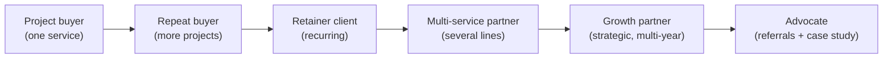
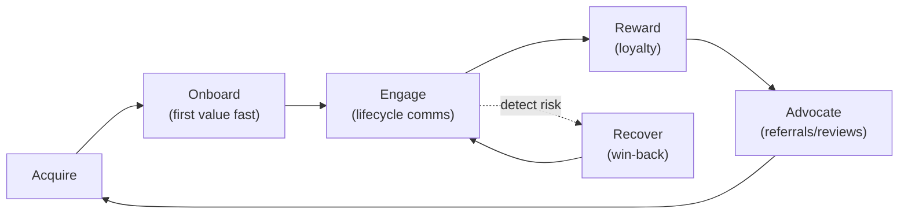

# 06 — Client Retention Model

Retention is the whole point. A 360° firm's enterprise value lives in **recurring
revenue and multi-year relationships**, not in the next pitch. This model covers
*both* sides of retention:

- **A) Retaining our clients** (keeping the agency–client relationship alive and growing).
- **B) Helping clients retain their customers** (the service we sell in Phase 5+).

Both run on the same logic: deliver value, prove it, deepen the relationship, repeat.

---

## A) Retaining Our Clients (Agency Relationship)

### A.1 The Retention Ladder

Each rung increases retention, margin, and lifetime value. The account team's job
is to move every client *up* the ladder.

### A.2 What Drives Agency Retention

| Driver | How we operationalize it |
|---|---|
| **Proven ROI** | One shared dashboard (`09`) that ties our work to the client's revenue |
| **Single relationship** | One account/growth-partner lead across all services (`07`) |
| **Proactive roadmap** | Quarterly business review (QBR) that always proposes the next phase |
| **Switching cost (earned)** | Integrated data + systems make us part of their operating fabric |
| **Responsiveness** | SLAs, fast communication, no dropped balls (`08`) |
| **Relationship depth** | Multiple stakeholders on both sides, not a single point of contact |

### A.3 The Quarterly Business Review (QBR) — the retention engine

Every retainer client gets a QBR. Structure:

1. **Results** — what we did, what it produced (KPI deltas vs targets).
2. **Insights** — what the data is telling us (the part they can't get elsewhere).
3. **Maturity check** — re-score them on the lifecycle map (`01`).
4. **Roadmap** — the next 1–2 phases and the projects that unlock them.
5. **Proposal** — a concrete, costed next step.

> The QBR is where renewal *and* expansion happen at the same time. No QBR should
> end without (a) a confirmed continuation and (b) a proposed expansion.

### A.4 Churn Early-Warning System

Watch these signals and intervene before renewal:

| Signal | Risk | Play |
|---|---|---|
| Falling engagement (slow replies, skipped QBRs) | High | Executive check-in, re-establish value |
| Flat or negative KPIs | High | Diagnostic + reset plan before they ask |
| Single point of contact leaves | High | Multi-thread the relationship fast |
| Scope shrinking | Medium | Re-discover needs; re-map maturity |
| Price sensitivity / discount requests | Medium | Re-anchor on ROI and outcomes |
| Going quiet near renewal | High | Proactive renewal conversation 60+ days out |

### A.5 Onboarding (retention starts on day one)

- **First 30 days set the tone.** A structured onboarding + an early "quick win"
  dramatically increases retention.
- Capture everything once into the shared CRM so the client never repeats themselves.
- Set KPI baselines immediately so value is provable later.
- Introduce the account team and the dashboard in week one.

---

## B) Helping Clients Retain *Their* Customers (the Phase 5 service)

This is what we sell — and it mirrors our own model.

### B.1 The Customer Retention Framework (CVR Loop)

### B.2 The Retention Toolkit We Deploy for Clients

| Lever | Tools / tactics | Service line |
|---|---|---|
| **Onboarding** | Welcome flows, setup help, first-value milestones | CX + Automation |
| **Lifecycle marketing** | Segmented email/SMS, triggered campaigns | Marketing + Automation |
| **Loyalty & rewards** | Points, tiers, referrals, VIP perks | CX + Marketing |
| **Support excellence** | Helpdesk, chatbot, SLAs, omnichannel | CX + Tech |
| **Reputation** | Review generation + management | Branding + Marketing |
| **Win-back** | Churn prediction + reactivation offers | Data + Marketing |
| **Community** | Online community, groups, webinars, content, advocacy | Branding + Marketing |

### B.3 Retention Metrics We Manage for Clients

| Metric | What it tells us |
|---|---|
| Repeat purchase rate | Are customers coming back? |
| Customer churn rate | How fast are we losing them? |
| Customer LTV | What is a customer worth over time? |
| Net Promoter Score (NPS) | Will they recommend? |
| Loyalty participation | Is the program working? |
| Reactivation rate | Are win-backs effective? |

---

## C) The Mirror Principle

> We sell retention because we *practice* retention. The same loop —
> **deliver value → prove it → deepen the relationship → expand** — runs at both
> levels. The client experiences it from us, sees it work, and trusts us to build
> it for them. Retention is both our service and our business model.

### Retention scorecard (run monthly, internally)

- [ ] Net Revenue Retention (NRR) trending up?
- [ ] Logo retention rate at/above target?
- [ ] Average services-per-client increasing?
- [ ] % of clients with a scheduled QBR in the next 90 days?
- [ ] Any account showing 2+ churn-warning signals (and is there a play)?
- [ ] # of active referrals / case studies from advocate-tier clients?
