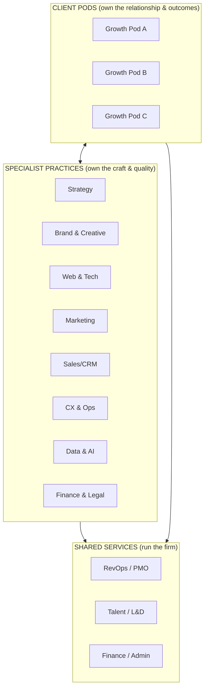
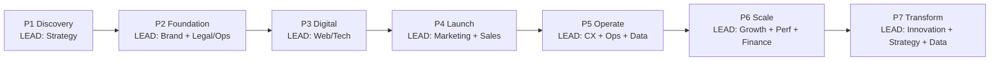
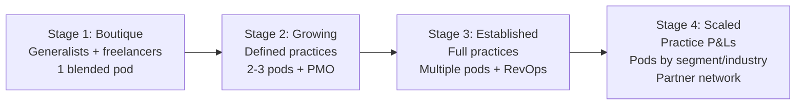

# 07 — Internal Team Structure by Phase

A 360° firm needs an org design that delivers a *single relationship* to the client
while keeping *deep specialist capability* inside. The answer is a **pod + practice
matrix**: client-facing pods own the relationship; specialist practices own the craft.

---

## 7.1 The Operating Model: Pods × Practices

- **Pods** are cross-functional, client-facing teams led by a Growth Partner Lead.
  They own the client roadmap, retention, and results across all phases.
- **Practices** are the centers of excellence. Specialists "live" in a practice
  (for craft, standards, and career growth) and are "deployed" into pods.
- **Shared services** (RevOps/PMO, Talent, Finance) keep the machine running.

> This is how firms stay integrated *and* deep: the client feels one team (the pod),
> while quality is guaranteed by the practices behind it.

---

## 7.2 Core Roles

| Role | Owns | Sits in |
|------|------|---------|
| **Growth Partner Lead (Account Lead)** | The client relationship, roadmap, retention, revenue | Pod |
| **Project / Delivery Manager** | Timelines, scope, resourcing, quality of delivery | Pod / PMO |
| **Strategist** | Insight, positioning, roadmap logic | Strategy practice |
| **Creative Director + designers** | Brand, creative, UX | Brand practice |
| **Web/Tech leads + developers** | Sites, apps, infrastructure, automation | Web/Tech practice |
| **Marketing leads + specialists** | SEO, paid, content, social, offline | Marketing practice |
| **Sales/CRM specialist (RevOps)** | Funnels, CRM, pipeline, CRO | Sales practice |
| **CX / Ops specialist** | Support, loyalty, SOPs, ERP | CX & Ops practice |
| **Data analyst / engineer** | Dashboards, attribution, insight, AI | Data practice |
| **Finance/Legal partners** | Compliance, budgeting, fundraising | Finance practice (often partly external) |

---

## 7.3 Which Team Leads Each Phase

The pod is constant; the **lead practice rotates** as the client moves through phases.

| Phase | Lead practice | Heavily involved | On standby |
|-------|---------------|------------------|------------|
| 1 Discovery | Strategy | Data, Finance, Brand | — |
| 2 Foundation | Brand + Legal/Ops | Web/Tech, Strategy | Marketing |
| 3 Digital | Web/Tech | Brand, Marketing, Automation | Sales |
| 4 Launch | Marketing + Sales | Brand, PR, Web/Tech, Data | CX |
| 5 Operate/Retain | CX + Ops + Data | Marketing, Automation, Tech | Strategy |
| 6 Scale | Strategy/Growth + Performance Mktg + Finance | Tech, Data, Ops | Brand |
| 7 Transform | Innovation + Strategy + Data | All practices | — |

> Throughout, the **Growth Partner Lead stays the same person**. Continuity of
> relationship is the asset; specialist leadership rotates underneath it.

---

## 7.4 The RACI for Cross-Functional Work

To prevent the classic "who owns this?" failure in integrated delivery:

| Activity | Responsible | Accountable | Consulted | Informed |
|---|---|---|---|---|
| Client roadmap & retention | Growth Partner Lead | Pod Director | Practice leads | Client |
| Project delivery | Delivery Manager | Growth Partner Lead | Specialists | Client |
| Craft quality / standards | Specialists | Practice lead | Delivery Manager | Pod |
| Data integrity / reporting | Data analyst | RevOps lead | All practices | Client |
| Cross-sell / new proposals | Growth Partner Lead | Pod Director | Strategy + Finance | — |

---

## 7.5 Scaling the Org (how headcount grows with the firm)

| Stage | Team shape | Capacity model |
|-------|-----------|----------------|
| **Boutique** | Generalists wear multiple hats; partners for legal/specialist gaps | Freelance + contractor flex |
| **Growing** | Practices forming; first dedicated PMO/RevOps | Core team + vetted freelancer bench |
| **Established** | Full practices, multiple pods, defined career ladders | Mostly in-house + specialist partners |
| **Scaled** | Practices run as P&Ls; pods specialized by industry/segment | In-house core + partner network + offshore delivery |

---

## 7.6 The Partner / Vendor Network (the "virtual" 360°)

No firm builds *everything* in-house on day one. A managed partner network lets you
offer the full 360° immediately while protecting margin and quality:

| Capability | Build in-house when… | Partner when… |
|---|---|---|
| Legal / compliance | Rarely (regulated) | Almost always — white-label legal partners |
| Specialized dev (apps, AI) | Recurring demand justifies it | Spiky / niche demand |
| Production (video, print, OOH) | High volume | Project-based |
| Niche marketing (PR, influencers) | Core to your positioning | Long-tail needs |

> **Rule:** the client always experiences *one firm*. Whether a capability is
> in-house or partner is our operational concern, never their problem. The Growth
> Partner Lead and shared systems (`08`, `09`) make the seams invisible.
