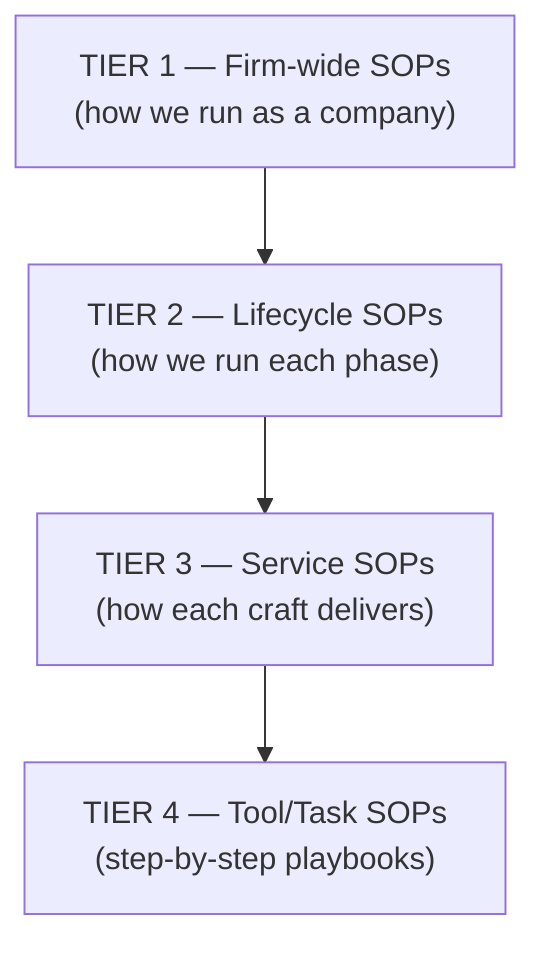
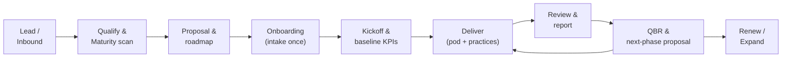

# 08 — SOP & Workflow Recommendations

SOPs (Standard Operating Procedures) are what turn a 360° *idea* into a 360°
*machine*. They make delivery consistent, integration reliable, and the firm
scalable — because quality stops depending on heroics and starts depending on systems.

---

## 8.1 The SOP Stack



| Tier | Examples | Owner |
|------|----------|-------|
| **1 — Firm-wide** | Onboarding, QBR, billing, escalation, data governance | Operations / PMO |
| **2 — Lifecycle** | Discovery process, launch process, retention process | Pod / Practice leads |
| **3 — Service** | "How we build a website", "How we run a paid campaign" | Practice leads |
| **4 — Tool/Task** | "Set up GA4", "Configure CRM pipeline", "Build a retargeting audience" | Specialists |

---

## 8.2 The Master Client Workflow (end to end)



> The loop from **QBR → Deliver** is the recurring-revenue engine. The workflow is
> deliberately circular, not linear — the relationship is designed to continue.

---

## 8.3 Foundational SOPs (build these first)

### SOP 1 — Client Onboarding (the most important SOP)
1. Create the client record in the **shared CRM** (single source of truth).
2. Run the **intake once**: goals, brand, access, stakeholders, history → store centrally.
3. Set **KPI baselines** and targets (so value is provable later).
4. Assign the **pod** and introduce the **Growth Partner Lead**.
5. Grant access to the **shared dashboard** + communication channel.
6. Schedule the **kickoff** and the **first QBR** date.
> Outcome: no team ever re-asks the client a question we already have an answer to.

### SOP 2 — Discovery & Proposal
1. Run the **maturity scan** (`01`) → locate the client on the lifecycle map.
2. Identify the lead phase + the next 1–2 phases.
3. Produce a **roadmap-first proposal** (not a service list).
4. Always present a **project + retainer** option.

### SOP 3 — Service Handoff (the integration SOP)
1. Upstream team completes the **handoff checklist** (assets, data, access).
2. Downstream team **confirms receipt** before starting (no silent starts).
3. Handoff logged in the project system with owner + date.
> This single SOP eliminates the #1 failure of integrated agencies: dropped handoffs.

### SOP 4 — Reporting & QBR
1. All teams report into **one KPI tree** (`09`), not separate reports.
2. Monthly snapshot auto-generated from the analytics layer.
3. Quarterly QBR: results → insights → maturity → roadmap → proposal.

### SOP 5 — Escalation & Issue Management
1. Severity levels defined (P1 outage → P4 minor).
2. Response-time SLAs per level.
3. Clear escalation path: Specialist → Delivery Manager → Growth Partner Lead → Director.

---

## 8.4 Service-Line Workflow Templates

### Website build (Web/Tech)
```
Brief → Architecture/Sitemap → Design → Build → Content → QA → Tracking setup → Launch → Handoff to Marketing
```
*Gate:* tracking & analytics must be live **before** Marketing drives traffic.

### Paid campaign (Marketing)
```
Objective → Audience → Creative → Tracking check → Launch → Daily monitor → Weekly optimize → Monthly report
```
*Gate:* pixels/UTMs verified and lead routing to CRM confirmed **before** spend.

### Brand identity (Brand)
```
Strategy input → Moodboard → Concepts → Refinement → Guidelines → Asset kit → Handoff to Web/Marketing
```
*Gate:* positioning from Strategy received **before** design starts.

### Retention program (CX)
```
Baseline metrics → Segment → Design journeys → Build automation → Launch → Measure → Optimize
```
*Gate:* CRM data clean and segmented **before** journey build.

---

## 8.5 Workflow Principles (the rules behind the SOPs)

| Principle | Why |
|---|---|
| **Single source of truth** | One CRM + analytics layer everyone reads/writes |
| **Capture once, reuse everywhere** | Eliminates re-discovery and client frustration |
| **Gates before spend/build** | Prevents expensive, untracked, off-brand work |
| **Confirmed handoffs** | No work begins until inputs are received and acknowledged |
| **Automate the repetitive** | Onboarding, reporting, follow-ups run on automation (`free humans for judgment`) |
| **Document as you go** | Every recurring task becomes a Tier-4 SOP; the library compounds |
| **Templatize deliverables** | Faster, consistent, higher-margin delivery |

---

## 8.6 Automation Opportunities (where SOPs become software)

| Workflow | Automate with | Benefit |
|---|---|---|
| Lead intake & routing | CRM + forms + workflow rules | Instant response, no lost leads |
| Onboarding tasks | Project tool templates | Consistent, fast starts |
| Reporting | Analytics → auto dashboards/snapshots | Hours saved, fewer errors |
| Follow-ups & nurture | Email/CRM automation | Nothing falls through cracks |
| QBR prep | Auto-pull KPI deltas into a template | QBRs always happen, always data-driven |
| Internal handoffs | Project tool + checklists + notifications | Reliable integration |

---

## 8.7 The SOP Library as an Asset

> Treat the SOP/knowledge library as **intellectual property and enterprise value**.
> A documented, repeatable 360° operating system is what makes the firm:
> - **scalable** (new hires onboard fast, quality holds),
> - **sellable** (the business runs without founder heroics), and
> - **consistent** (every client gets the A-team experience).
>
> Review SOPs quarterly. Every recurring mistake becomes a new or updated SOP.
