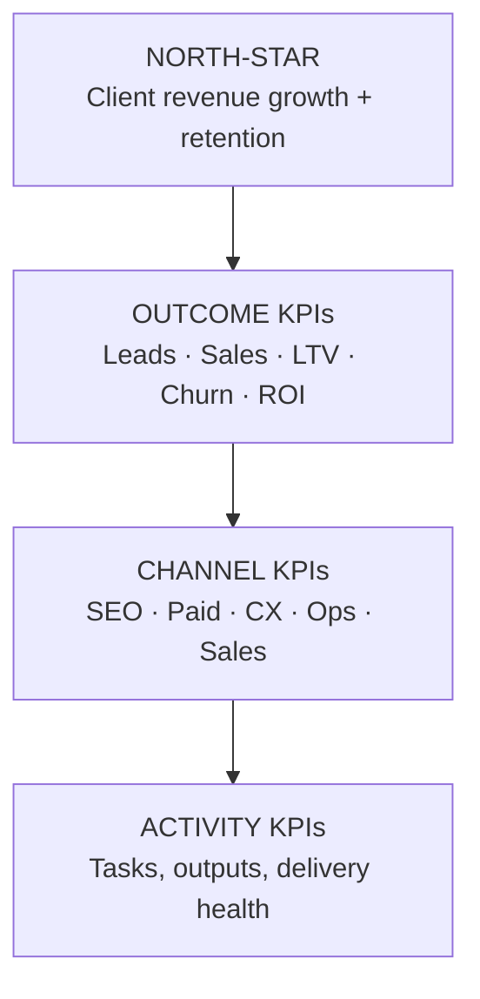
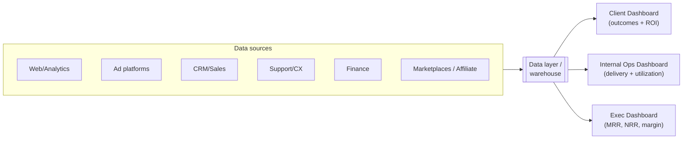

# 09 — KPI Tracking System

The KPI system is the **shared truth** that holds the 360° model together. It does
three jobs at once:
1. Proves ROI to the client (drives retention).
2. Lets every service line see the same numbers (drives integration).
3. Lets leadership run the firm (drives the business).

> **One KPI tree, not one report per team.** Every team's metric must roll up to a
> client outcome and, ultimately, to revenue.

---

## 9.1 The KPI Pyramid

- **Activity** = what we do (leading, controllable).
- **Channel** = how each discipline performs.
- **Outcome** = what the client gets (the proof).
- **North-star** = the client's growth + the relationship's health.

When a north-star number moves, you can trace *down* the pyramid to the cause.

---

## 9.2 KPIs by Lifecycle Phase

| Phase | Primary KPIs | Leading indicators |
|-------|-------------|--------------------|
| **1 Discovery** | Strategy delivered, decisions enabled | Research completeness, insight quality, client confidence |
| **2 Foundation** | Brand + legal + ops live | Time-to-setup, asset completeness, compliance done |
| **3 Digital** | Site live, conversion-ready | Page speed, mobile UX score, tracking coverage, funnel completeness |
| **4 Launch** | CAC, leads, first sales, ROAS | CTR, CPC, conversion rate, lead volume, lead quality |
| **5 Operate/Retain** | Retention rate, CSAT/NPS, LTV, efficiency | Repeat rate, response time, ticket resolution, automation coverage |
| **6 Scale** | Revenue growth, new-market traction, LTV:CAC | Scaled ROAS, market penetration, ops capacity |
| **7 Transform** | Innovation adoption, future-readiness | AI/automation usage, new-revenue %, transformation milestones |

---

## 9.3 The Universal Metrics (track for every client, always)

### Acquisition & marketing
| Metric | Definition |
|---|---|
| **CAC** | Cost to acquire a customer (blended across digital channels) |
| **ROAS** | Revenue ÷ ad spend |
| **Conversion rate** | Visitors/leads → customers |
| **Lead volume & quality** | MQLs/SQLs and their close rate |
| **Traffic & reach** | Sessions + total reach across channels |

### Revenue & retention
| Metric | Definition |
|---|---|
| **Customer LTV** | Total value of a customer over their lifetime |
| **LTV:CAC ratio** | Health of the growth engine (aim well above 1:1) |
| **Churn rate** | % of customers lost per period |
| **Repeat purchase rate** | % buying again |
| **MRR / revenue growth** | Recurring or total revenue trend |

### Experience & operations
| Metric | Definition |
|---|---|
| **NPS / CSAT** | Satisfaction & advocacy |
| **First response / resolution time** | Support efficiency |
| **Process cycle time** | Operational efficiency |

---

## 9.4 Our Own Firm KPIs (running the 360° business)

Distinct from client KPIs — these measure whether *our* model is working.

| Category | KPI | Why it matters |
|---|---|---|
| **Recurring revenue** | MRR / ARR | The base of enterprise value |
| **Retention** | Net Revenue Retention (NRR), logo retention | Is the flywheel holding? |
| **Expansion** | Avg. services per client, cross-sell rate | Are clients climbing the ladder (`06`)? |
| **Progression** | Phase-progression rate | Are clients advancing through the lifecycle? |
| **Attach** | Retainer attach rate on projects | Is recurring becoming the default? |
| **Profitability** | Gross margin per service line, per pod | Which work actually pays? |
| **Utilization** | Billable utilization by practice | Capacity health |
| **Pipeline** | Proposal win rate, pipeline value | Future revenue |
| **Delivery** | On-time %, rework rate, CSAT | Operational quality |

---

## 9.5 The Dashboard Architecture

| Dashboard | Audience | Shows |
|---|---|---|
| **Client dashboard** | The client | Their outcomes, ROI, funnel, retention — the proof |
| **Ops dashboard** | Pods & practices | Delivery health, KPIs by channel, utilization |
| **Exec dashboard** | Leadership | MRR/ARR, NRR, margin, pipeline, retention |

> Every channel — including marketplaces and affiliate — flows into the **same**
> warehouse so all digital channels live in one funnel (see
> [`05`](05-digital-channel-strategy.md)).

---

## 9.6 Reporting Cadence

| Cadence | What | Audience |
|---|---|---|
| **Real-time / daily** | Spend, pacing, anomalies, outages | Delivery teams |
| **Weekly** | Channel performance, optimizations | Pod + client lead |
| **Monthly** | Outcome KPIs vs targets, snapshot | Client + pod |
| **Quarterly (QBR)** | Results, insights, maturity, roadmap | Client execs + Growth Partner Lead |
| **Quarterly (internal)** | Firm KPIs, margins, retention | Leadership |

---

## 9.7 Principles for KPIs That Actually Work

| Principle | Meaning |
|---|---|
| **Tie every metric to revenue/retention** | Kill vanity metrics that don't ladder up |
| **Baseline first** | Capture a starting point at onboarding so deltas are provable |
| **Targets, not just actuals** | Every KPI has a target and an owner |
| **One source of truth** | All dashboards read the same warehouse |
| **Leading + lagging** | Track activities (controllable) and outcomes (results) |
| **Make it visible** | Clients and teams see live dashboards, not buried PDFs |
| **Act on it** | Each review ends in decisions, not just observation |
