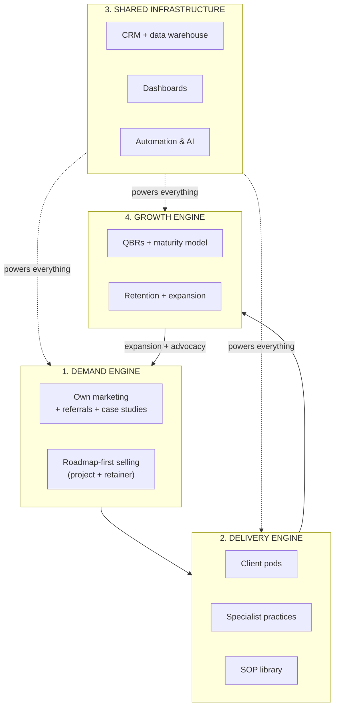

# 10 — The Scalable 360° Business Operating Model

This is the synthesis: how all the previous documents combine into **one operating
model** that runs, scales, and compounds. It positions the firm as a long-term
growth partner rather than a service vendor.

---

## 10.1 The Model in One Picture

Four engines, one infrastructure. The **Growth Engine feeds the Demand Engine**
(expansion + referrals), which is what makes the whole thing a flywheel.

---

## 10.2 The Five Pillars of the Operating Model

| Pillar | What it is | Document |
|--------|-----------|----------|
| **1. Lifecycle** | The 7-phase journey every client travels | [`01`](01-client-lifecycle-map.md) |
| **2. Integration** | Services connected to phases and to each other | [`02`](02-service-to-phase-integration.md) |
| **3. Data core** | One CRM + analytics layer as the nervous system | [`09`](09-kpi-tracking-system.md) |
| **4. Recurring revenue** | Projects converting to retainers + expansion | [`04`](04-revenue-opportunities.md), [`06`](06-client-retention-model.md) |
| **5. Systemized delivery** | Pods, practices, SOPs that scale quality | [`07`](07-team-structure.md), [`08`](08-sop-and-workflows.md) |

> Remove any one pillar and the model collapses into "just another agency."
> Together they create a **defensible, compounding, sellable** business.

---

## 10.3 What Makes It *Scalable* (not just big)

| Lever | Mechanism | Effect |
|---|---|---|
| **Productized services** | Packaged offers per phase (`04`) | Predictable scope, margin, faster sales |
| **SOP-driven delivery** | Documented, repeatable processes (`08`) | Quality independent of individuals |
| **Pod model** | Replicable client teams (`07`) | Add pods to add capacity without chaos |
| **Shared infrastructure** | One data + automation layer (`09`) | Marginal cost of each new client drops |
| **Partner network** | Flex capacity via vetted partners (`07`) | Offer full 360° without full headcount |
| **Automation & AI** | Onboarding, reporting, nurture automated (`08`) | Humans do judgment; systems do repetition |
| **Recurring revenue** | Retainer-first model (`04`) | Predictable base funds growth |

---

## 10.4 The 90-Day & 12-Month Implementation Roadmap

### First 90 days — build the spine
1. **Stand up the data core**: one CRM + analytics warehouse as the single source of truth.
2. **Document the foundational SOPs**: onboarding, handoff, reporting, QBR (`08`).
3. **Define the KPI tree + dashboards**: client, ops, exec (`09`).
4. **Map current clients** on the lifecycle/maturity model (`01`) → find cross-sell.
5. **Adopt roadmap-first selling**: every proposal shows phase + next phases + retainer.

### Months 4–12 — turn the flywheel
6. **Form pods + practices** (`07`); assign Growth Partner Leads.
7. **Productize** the top offers per phase (`04`); set packaging tiers.
8. **Launch the QBR engine** for all retainer clients (`06`).
9. **Build the partner network** to cover capability gaps (`07`).
10. **Automate** onboarding, reporting, and nurture (`08`).
11. **Instrument online + offline** into one funnel (`05`).
12. **Review firm KPIs** quarterly: NRR, services/client, margin (`09`).

---

## 10.5 Maturity of the *Firm* Itself

The firm travels its own lifecycle — apply the model to ourselves:

| Stage | Hallmark | Focus |
|-------|----------|-------|
| **1. Service shop** | Sells individual projects | Build the data core + SOPs |
| **2. Multi-service** | Sells several services, weakly connected | Integrate handoffs + shared dashboard |
| **3. Integrated 360°** | One relationship, connected services, retainers | Pods, QBRs, productization |
| **4. Growth partner** | Multi-year partnerships, performance/equity deals | Industry pods, partner network, scale |
| **5. Platform** | Repeatable system, runs without founders, acquirable | Productized IP, P&L practices, M&A |

> **The destination:** a firm where the operating system — not the founders — delivers
> the outcomes. That is what makes it scalable, valuable, and sellable.

---

## 10.6 The One-Sentence Positioning

> **"We are not a service provider you hire for a task — we are the growth partner
> who maps your entire business journey, connects every capability you need across
> online and offline, and stays with you from idea to enterprise."**

### The promises that back it up
1. **One relationship, every capability.** A single team, the full 360°.
2. **Connected, not bundled.** Services share data and compound on each other.
3. **Proven, not promised.** One dashboard ties our work to your revenue.
4. **Online + offline, one strategy.** We move budget to whatever works.
5. **We grow when you grow.** Retainers and performance models align incentives.
