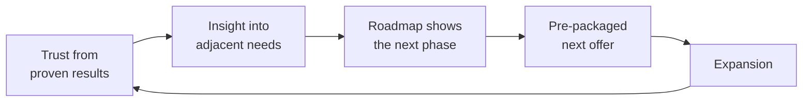

# 11 — How Top 360° Providers Operate (Benchmark)

This document synthesizes the *patterns* that leading 360° firms — digital
transformation agencies, full-service marketing groups, business consultancies,
startup accelerators, brand strategy firms, and technology consultancies — use to
manage the complete business lifecycle. The goal is to adopt the patterns that
matter and adapt them to our model.

> Note: this is a synthesis of widely-observed industry operating patterns, not a
> profile of any single named company. Use it as a design reference.

---

## 11.1 The Six Archetypes and What We Steal From Each

| Archetype | What they're great at | The pattern we adopt |
|-----------|----------------------|----------------------|
| **Digital transformation agencies** | Connecting strategy → tech → change at enterprise scale | Treat technology + data as the connective layer across all services |
| **Full-service marketing groups** | Integrated campaigns across many channels under one roof | One account team orchestrating many specialties; media as a recurring retainer |
| **Business consulting firms** | Insight, frameworks, executive trust, land-and-expand | Sell *outcomes and roadmaps*; expand via trusted advisory relationships |
| **Startup accelerators** | End-to-end founder support, sometimes for equity | Phase-based support + aligned incentives (performance/equity options) |
| **Brand strategy firms** | Deep positioning that anchors everything downstream | Make strategy/brand the upstream input every other service builds on |
| **Technology consultancies** | Building scalable systems and platforms | Productize and systematize delivery; build reusable assets/IP |

---

## 11.2 The Common Operating Patterns (what they all do)

### 1. Lifecycle / journey thinking
Top firms organize around the **client's journey**, not their own service catalog.
They meet the client where they are and map a path forward. (→ our `01`)

### 2. Land-and-expand
They enter with a focused, high-trust engagement, prove value fast, then expand
across services and time. The first project is a *door*, not the deal. (→ our `04`, `06`)

### 3. The retainer / recurring model
Enterprise value comes from **recurring revenue** — retainers, managed services, and
long-term programs — not one-off projects. Predictable revenue funds growth and
makes the firm valuable. (→ our `04`)

### 4. Integrated account management
A **single senior relationship owner** coordinates all the specialists, so the client
experiences one partner. This is the difference between "full-service" and
"integrated." (→ our `07`)

### 5. Data and measurement as the product
Leading firms compete on **provable ROI**. Shared dashboards and clear attribution
turn subjective work into objective value — which drives renewals. (→ our `09`)

### 6. Productization and systematization
They package repeatable offers and document delivery so quality scales and margins
hold. The operating system becomes the asset. (→ our `08`, `10`)

### 7. Cross-selling as a system, not luck
Expansion is engineered through structured reviews (QBRs), maturity assessments, and
roadmaps — not left to chance. (→ our `06`)

### 8. Partner ecosystems
Few build everything in-house. They use vetted partner networks to offer breadth
while protecting focus and margin. (→ our `07`)

### 9. Automation and AI in delivery
Top firms automate the repeatable (onboarding, reporting, nurture) and increasingly
use AI to scale insight and personalization. (→ our `08`, Phase 7)

### 10. Aligned incentives
The most differentiated players tie a portion of compensation to client outcomes —
performance fees, revenue share, or equity — signaling true partnership. (→ our `04`)

---

## 11.3 The Retainer / Long-Term Management Playbook

How leading firms keep clients for years:

| Practice | What it looks like |
|---|---|
| **Onboarding rigor** | Structured intake, early quick win, baseline KPIs set day one |
| **Regular business reviews** | Quarterly strategic reviews that report results *and* propose next steps |
| **Multi-threading** | Relationships across many stakeholders, not one contact |
| **Roadmaps** | A visible forward plan that always has a "next" |
| **Proactive insight** | Bringing the client ideas before they ask (the trust multiplier) |
| **Embedded systems** | Becoming part of the client's data/ops fabric (earned switching cost) |

---

## 11.4 Cross-Selling Systems (how expansion actually happens)

The pattern is consistent: **results → trust → insight → roadmap → packaged offer →
expansion**. Firms that systematize this (via QBRs, maturity models, and productized
offers) grow accounts predictably; firms that don't rely on luck.

---

## 11.5 Data-Driven Growth Strategies

| Strategy | How top firms use it |
|---|---|
| **Single source of truth** | One CRM/warehouse feeding all decisions |
| **Attribution** | Connecting spend across digital channels to revenue |
| **Cohort / LTV analysis** | Understanding which clients/customers are worth most |
| **Benchmarking** | Comparing performance to industry baselines to prove value |
| **Predictive models** | Forecasting churn, demand, and growth to act early |
| **Continuous experimentation** | Test-and-learn culture across channels |

---

## 11.6 Gap Analysis Template (us vs. the best)

Use this to assess and prioritize. Score each 1–5.

| Capability | Best-in-class behavior | Our score (1–5) | Priority |
|---|---|---|---|
| Lifecycle/journey selling | Sells roadmaps, not tasks | | |
| Recurring revenue mix | Retainer-heavy, predictable | | |
| Integrated account mgmt | One owner across services | | |
| Shared data & dashboards | One source of truth, provable ROI | | |
| Productized offers | Packaged, repeatable, high-margin | | |
| SOP / systematized delivery | Documented, scalable quality | | |
| Cross-sell system | QBRs + maturity + packaged offers | | |
| Partner network | Breadth without bloat | | |
| Automation & AI | Repetition automated, insight scaled | | |
| Aligned incentives | Performance/equity options | | |

> **How to use it:** the lowest scores with the highest strategic impact become the
> first initiatives in the 90-day roadmap ([`10`](10-operating-model.md)).

---

## 11.7 Key Takeaways

1. **The journey is the product.** Top firms sell a path, not a deliverable.
2. **Recurring revenue is the prize.** Projects are doors to long-term partnerships.
3. **Integration beats breadth.** "Connected" is worth far more than "full-service."
4. **Data earns the renewal.** Provable ROI is the retention engine.
5. **The system is the asset.** Productization + SOPs make the firm scalable and sellable.
6. **Incentive alignment signals partnership.** Sharing in outcomes is the ultimate trust signal.
